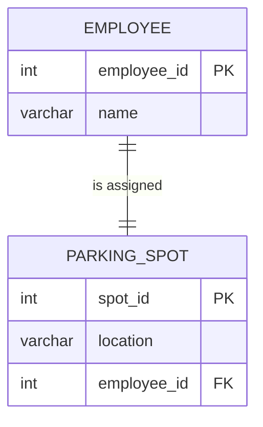
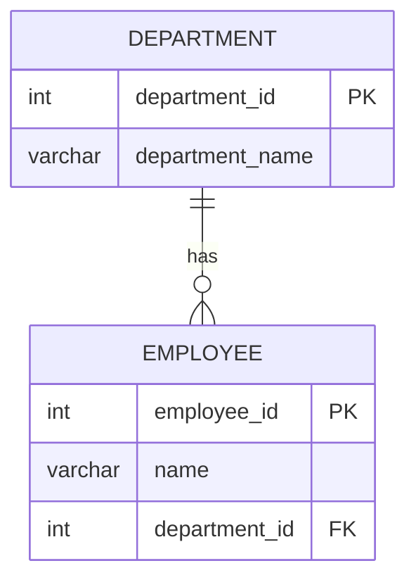
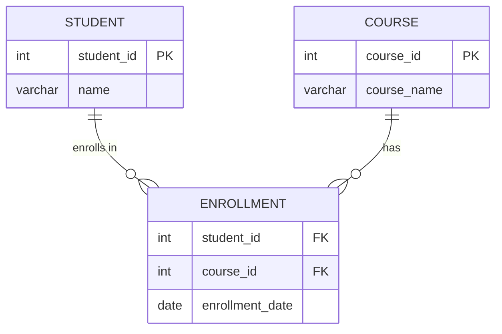
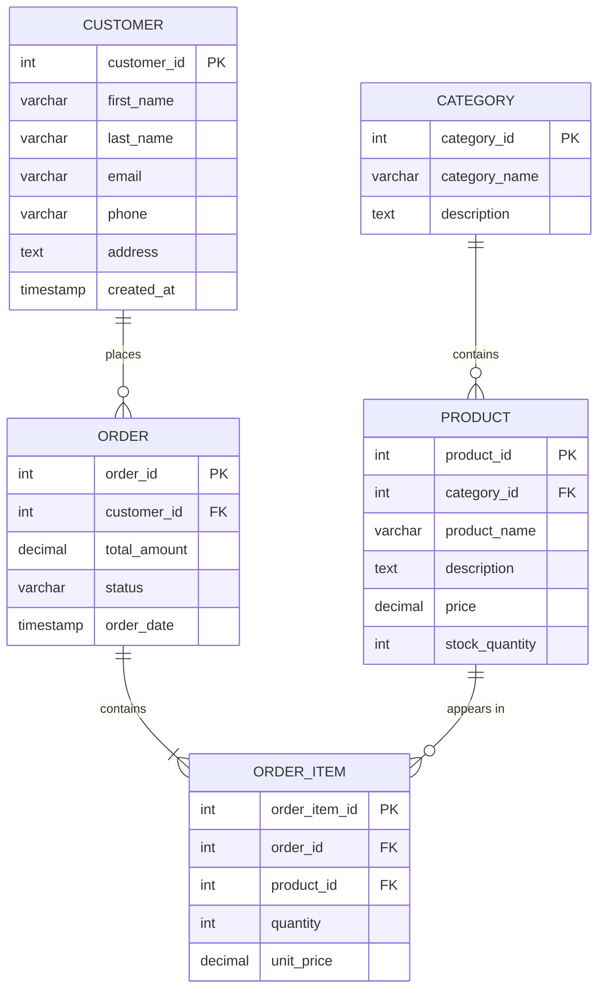

# Entity-Relationship Diagrams (ERD)

## Table of Contents

- [What is an ERD?](#what-is-an-erd)
- [Why ERDs Matter](#why-erds-matter)
- [Components of an ERD](#components-of-an-erd)
  - [Entities](#1-entities)
  - [Attributes](#2-attributes)
  - [Relationships](#3-relationships)
- [Cardinality](#cardinality)
  - [One-to-One (1:1)](#one-to-one-11)
  - [One-to-Many (1:N)](#one-to-many-1n)
  - [Many-to-Many (M:N)](#many-to-many-mn)
- [How to Read an ERD](#how-to-read-an-erd)
- [Notation Types](#notation-types)
  - [Crow's Foot Notation](#crows-foot-notation)
  - [Chen Notation](#chen-notation)
  - [Comparison Table](#comparison-table)
- [Practical Example: E-Commerce ERD](#practical-example-e-commerce-erd)
- [Tips for Designing ERDs in Interviews](#tips-for-designing-erds-in-interviews)
- [Common Mistakes](#common-mistakes)
- [Key Takeaways](#key-takeaways)

---

## What is an ERD?

An **Entity-Relationship Diagram (ERD)** is a visual representation of the data model for a database. It shows the **entities** (tables), their **attributes** (columns), and the **relationships** between them.

Think of it as the **blueprint** of a database — just like an architect draws a floor plan before building a house, a database designer creates an ERD before writing any SQL.

```
Business Requirements → ERD → Logical Schema → Physical Tables
```

---

## Why ERDs Matter

| Reason | Explanation |
|--------|-------------|
| **Communication** | ERDs give developers, DBAs, and business stakeholders a common visual language |
| **Planning** | Catch design flaws early, before writing a single line of SQL |
| **Documentation** | Serve as living documentation for current and future team members |
| **Normalization** | Help identify redundancy and ensure data is properly structured |
| **Scalability** | A well-designed ERD leads to a database that scales cleanly |

> In real-world projects, skipping the ERD phase is one of the top causes of costly database redesigns later.

---

## Components of an ERD

### 1. Entities

An **entity** represents a real-world object or concept that we want to store data about. Each entity becomes a **table** in the database.

**Examples:**
- `customers` — stores customer information
- `orders` — stores order records
- `products` — stores product catalog data

Entities are drawn as **rectangles** in most ERD notations.

### 2. Attributes

**Attributes** are the properties or columns of an entity.

| Attribute Type | Description | Example |
|----------------|-------------|---------|
| **Simple** | Cannot be divided further | `first_name`, `price` |
| **Composite** | Can be broken into sub-parts | `full_name` → `first_name` + `last_name` |
| **Derived** | Computed from other attributes | `age` (derived from `date_of_birth`) |
| **Multi-valued** | Can hold multiple values | `phone_numbers` (a person may have many) |
| **Key Attribute** | Uniquely identifies an entity | `customer_id`, `order_id` |

### 3. Relationships

A **relationship** describes how two entities are associated with each other.

**Examples:**
- A customer **places** an order
- A product **belongs to** a category
- A student **enrolls in** a course

Relationships are drawn as **lines** connecting entities, with labels describing the association.

---

## Cardinality

**Cardinality** defines the numerical relationship between two entities — how many instances of one entity can be associated with instances of another.

### One-to-One (1:1)

> One instance of Entity A is associated with **exactly one** instance of Entity B.

**Example:** Each `employee` has exactly one `parking_spot`, and each `parking_spot` is assigned to exactly one `employee`.



### One-to-Many (1:N)

> One instance of Entity A is associated with **many** instances of Entity B, but each instance of B belongs to only **one** A.

**Example:** One `department` has many `employees`, but each `employee` works in only one `department`.



### Many-to-Many (M:N)

> Many instances of Entity A can be associated with **many** instances of Entity B.

**Example:** A `student` can enroll in many `courses`, and a `course` can have many `students`.

> **Important:** M:N relationships cannot be directly implemented in relational databases. They require a **junction table** (also called bridge/associative table).



### Cardinality Summary Table

| Cardinality | Symbol (Crow's Foot) | Example |
|-------------|----------------------|---------|
| One-to-One | `\|\|--\|\|` | Employee ↔ Parking Spot |
| One-to-Many | `\|\|--o{` | Department → Employees |
| Many-to-Many | `}o--o{` (via junction) | Students ↔ Courses |

---

## How to Read an ERD

Reading an ERD follows a simple pattern. For each relationship line, read it as a sentence:

```
[Entity A] [cardinality] [relationship verb] [cardinality] [Entity B]
```

**Example readings:**

| ERD Notation | Read As |
|--------------|---------|
| `CUSTOMER \|\|--o{ ORDER` | One customer places zero or many orders |
| `ORDER \|\|--\|\| INVOICE` | One order has exactly one invoice |
| `STUDENT }o--o{ COURSE` | Many students enroll in many courses |

**Crow's Foot Symbol Guide:**

```
||    = exactly one (mandatory)
o|    = zero or one (optional)
|{    = one or many (mandatory)
o{    = zero or many (optional)
```

---

## Notation Types

### Crow's Foot Notation

The most widely used notation in industry tools (pgAdmin, MySQL Workbench, dbdiagram.io).

**Symbols:**

```
─────────||  Exactly one (mandatory)
─────────o|  Zero or one (optional)
─────────|<  One or many (mandatory)
─────────o<  Zero or many (optional)
```

**Characteristics:**
- Uses lines with "feet" (fork-like symbols) to indicate "many"
- Circles indicate "zero" (optional)
- Bars (|) indicate "one" or "mandatory"
- Entities are rectangles with attributes listed inside

### Chen Notation

The original notation proposed by Peter Chen in 1976. Common in academic/textbook settings.

**Symbols:**

| Symbol | Represents |
|--------|------------|
| Rectangle | Entity |
| Ellipse | Attribute |
| Diamond | Relationship |
| Double Rectangle | Weak Entity |
| Double Ellipse | Multi-valued Attribute |
| Dashed Ellipse | Derived Attribute |
| Underlined text | Primary Key |

**Characteristics:**
- Relationships are shown as diamonds connecting entities
- Attributes branch out from entities as ovals
- Cardinality written as numbers (1, N, M) near the entity
- More verbose but very explicit

### Comparison Table

| Feature | Crow's Foot | Chen |
|---------|-------------|------|
| **Used In** | Industry tools, professional work | Academic textbooks, university courses |
| **Readability** | Compact, easy to scan | Detailed, can be cluttered for large schemas |
| **Attributes** | Listed inside entity box | Shown as separate ovals |
| **Relationships** | Lines with symbols | Diamond shapes |
| **Best For** | Implementation-focused design | Conceptual-level understanding |

---

## Practical Example: E-Commerce ERD

Let's design a complete ERD for an e-commerce system with **customers**, **orders**, **products**, and **categories**.

### Business Requirements

1. A **customer** can place many **orders**
2. Each **order** contains one or more **products** (with quantity and price per item)
3. Each **product** belongs to one **category**
4. A **category** can have many **products**
5. Each **order** has a total amount and status

### The Complete ERD



### Reading the ERD

| Relationship | Reading |
|--------------|---------|
| `CUSTOMER \|\|--o{ ORDER` | One customer can place zero or many orders |
| `ORDER \|\|--\|{ ORDER_ITEM` | One order must contain one or many order items |
| `PRODUCT \|\|--o{ ORDER_ITEM` | One product can appear in zero or many order items |
| `CATEGORY \|\|--o{ PRODUCT` | One category can contain zero or many products |

### Why ORDER_ITEM Exists

The relationship between `ORDER` and `PRODUCT` is many-to-many:
- One order can contain many products
- One product can appear in many orders

Since relational databases cannot directly represent M:N, we use `ORDER_ITEM` as a **junction table** that also stores order-specific data (`quantity`, `unit_price`).

### Corresponding SQL

```sql
CREATE TABLE categories (
    category_id   SERIAL PRIMARY KEY,
    category_name VARCHAR(100) NOT NULL,
    description   TEXT
);

CREATE TABLE products (
    product_id     SERIAL PRIMARY KEY,
    category_id    INT REFERENCES categories(category_id),
    product_name   VARCHAR(200) NOT NULL,
    description    TEXT,
    price          DECIMAL(10,2) NOT NULL CHECK (price > 0),
    stock_quantity INT DEFAULT 0 CHECK (stock_quantity >= 0)
);

CREATE TABLE customers (
    customer_id SERIAL PRIMARY KEY,
    first_name  VARCHAR(50) NOT NULL,
    last_name   VARCHAR(50) NOT NULL,
    email       VARCHAR(100) UNIQUE NOT NULL,
    phone       VARCHAR(20),
    address     TEXT,
    created_at  TIMESTAMP DEFAULT CURRENT_TIMESTAMP
);

CREATE TABLE orders (
    order_id     SERIAL PRIMARY KEY,
    customer_id  INT NOT NULL REFERENCES customers(customer_id),
    total_amount DECIMAL(10,2) DEFAULT 0,
    status       VARCHAR(20) DEFAULT 'pending',
    order_date   TIMESTAMP DEFAULT CURRENT_TIMESTAMP
);

CREATE TABLE order_items (
    order_item_id SERIAL PRIMARY KEY,
    order_id      INT NOT NULL REFERENCES orders(order_id) ON DELETE CASCADE,
    product_id    INT NOT NULL REFERENCES products(product_id),
    quantity      INT NOT NULL CHECK (quantity > 0),
    unit_price    DECIMAL(10,2) NOT NULL CHECK (unit_price > 0)
);
```

---

## Tips for Designing ERDs in Interviews

### Step-by-Step Approach

1. **Clarify requirements** — Ask questions about the business domain before drawing anything
2. **Identify entities** — List all the nouns (customer, order, product, etc.)
3. **Identify relationships** — List the verbs connecting entities (places, contains, belongs to)
4. **Determine cardinality** — For each relationship, ask "how many of A can relate to B?"
5. **Add attributes** — List key columns for each entity
6. **Identify keys** — Mark primary keys and foreign keys
7. **Resolve M:N** — Break many-to-many into junction tables
8. **Review and refine** — Check for redundancy, missing constraints, normalization

### Interview Do's and Don'ts

| ✅ Do | ❌ Don't |
|-------|----------|
| Start by asking clarifying questions | Jump straight into drawing tables |
| Think out loud about your design decisions | Design silently |
| Identify and resolve M:N relationships | Leave M:N as direct links between tables |
| Add appropriate constraints (NOT NULL, UNIQUE) | Forget about data integrity |
| Consider edge cases (soft deletes, history) | Assume the simplest scenario only |
| Name tables/columns consistently | Use inconsistent naming (`userId` vs `customer_id`) |

### Common Interview ERD Scenarios

| Scenario | Key Entities |
|----------|-------------|
| E-Commerce | Customers, Orders, Products, Categories, Reviews |
| Social Media | Users, Posts, Comments, Likes, Followers |
| Hospital | Patients, Doctors, Appointments, Departments, Prescriptions |
| Library | Books, Authors, Members, Loans, Publishers |
| School | Students, Courses, Teachers, Enrollments, Grades |

---

## Common Mistakes

| Mistake | Why It's Wrong | Fix |
|---------|---------------|-----|
| Skipping the ERD | Leads to messy, unplanned schema | Always draw before coding |
| Not resolving M:N | Relational DBs can't store M:N directly | Use junction/bridge tables |
| Too many attributes per entity | Violates normalization, causes redundancy | Break into related entities |
| Missing primary keys | Every entity must be uniquely identifiable | Add a PK to every table |
| Ignoring optionality | Not all relationships are mandatory | Use correct cardinality symbols |
| Using vague names | `data`, `info`, `stuff` are not descriptive | Use clear, specific names |

---

## Key Takeaways

1. **An ERD is the blueprint** of your database — always create one before writing SQL
2. **Three core components**: Entities (tables), Attributes (columns), Relationships (connections)
3. **Cardinality** defines how many instances relate: 1:1, 1:N, or M:N
4. **M:N relationships** must be resolved using junction tables in relational databases
5. **Crow's Foot notation** is the industry standard; **Chen notation** is common in academics
6. **Good ERD design** starts with understanding business requirements, not database syntax
7. **In interviews**, follow a structured approach: entities → relationships → cardinality → attributes → keys
