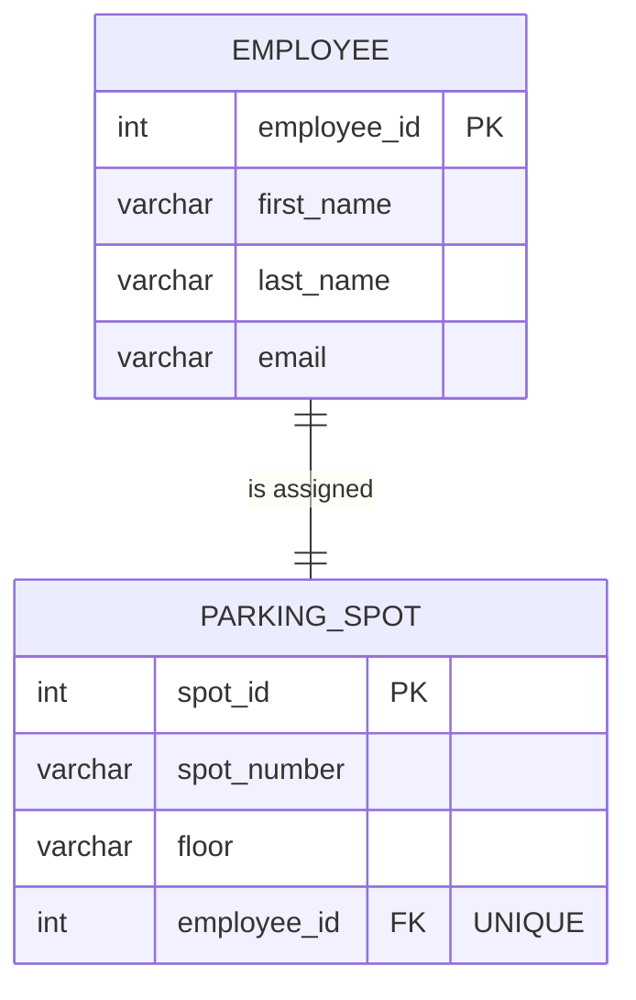
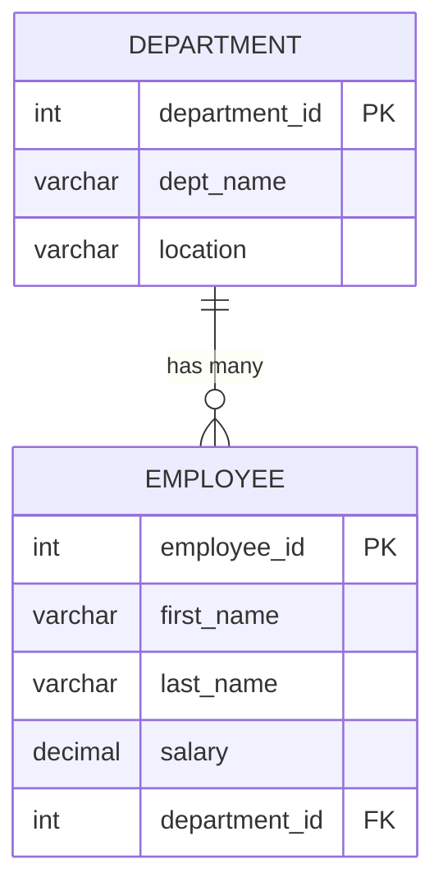
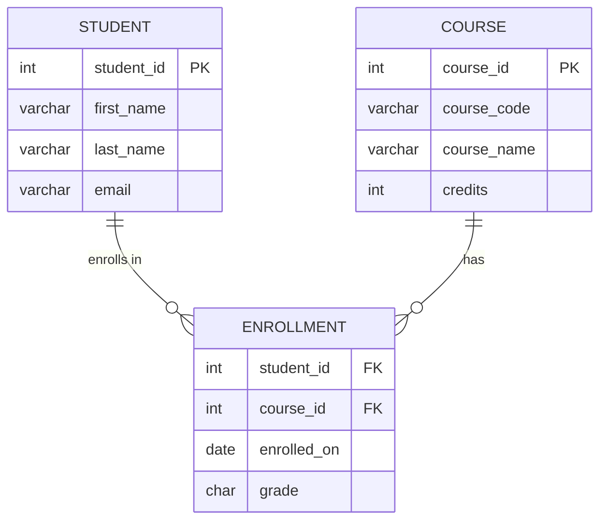
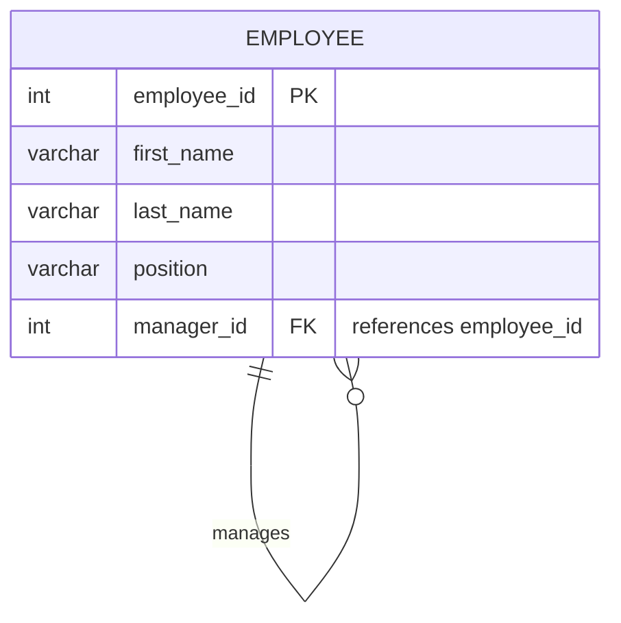

# Database Relationships

## Table of Contents

- [What is a Relationship?](#what-is-a-relationship)
- [One-to-One (1:1)](#one-to-one-11)
- [One-to-Many (1:N)](#one-to-many-1n)
- [Many-to-Many (M:N)](#many-to-many-mn)
  - [The Junction Table Solution](#the-junction-table-solution)
- [Self-Referencing Relationships](#self-referencing-relationships)
- [Participation Constraints](#participation-constraints)
  - [Total Participation](#total-participation)
  - [Partial Participation](#partial-participation)
  - [Comparison Table](#comparison-table)
- [Relationship Summary](#relationship-summary)
- [Full SQL Example: Company Database](#full-sql-example-company-database)
- [Common Mistakes](#common-mistakes)
- [Key Takeaways](#key-takeaways)

---

## What is a Relationship?

A **relationship** in a database describes how two entities (tables) are connected. Relationships define the rules for how data in one table relates to data in another.

In the real world:
- A **customer** _places_ an **order**
- An **employee** _works in_ a **department**
- A **student** _enrolls in_ a **course**

In SQL, relationships are implemented using **foreign keys** — a column in one table that references the primary key of another table.

```
┌──────────────┐         FK          ┌──────────────┐
│  DEPARTMENT  │◄────────────────────│   EMPLOYEE   │
│ department_id│                     │ employee_id  │
│ dept_name    │                     │ name         │
│              │                     │ department_id│ ← references departments
└──────────────┘                     └──────────────┘
```

---

## One-to-One (1:1)

> **One** instance of Entity A is associated with **exactly one** instance of Entity B, and vice versa.

### When to Use

1:1 relationships are uncommon but useful when:
- You want to **split a large table** for performance or security reasons
- Certain data is **optional** and you don't want many NULL columns
- Sensitive data needs to be in a **separate, access-controlled** table

### Example: Employee ↔ Parking Spot

Each employee is assigned exactly one parking spot, and each parking spot belongs to exactly one employee.



### SQL Implementation

```sql
CREATE TABLE employees (
    employee_id SERIAL PRIMARY KEY,
    first_name  VARCHAR(50) NOT NULL,
    last_name   VARCHAR(50) NOT NULL,
    email       VARCHAR(100) UNIQUE NOT NULL
);

CREATE TABLE parking_spots (
    spot_id      SERIAL PRIMARY KEY,
    spot_number  VARCHAR(10) NOT NULL,
    floor        VARCHAR(10),
    employee_id  INT UNIQUE REFERENCES employees(employee_id)
    --                ^^^^^^
    --  The UNIQUE constraint on the FK enforces 1:1
    --  Without UNIQUE, this would be 1:N (many spots per employee)
);
```

### How 1:1 Works

| Constraint | Effect |
|------------|--------|
| `REFERENCES employees(employee_id)` | Ensures the value exists in `employees` |
| `UNIQUE` on `employee_id` | Ensures each employee has **at most one** spot |
| Together | Creates a **1:1 relationship** |

### Inserting Data

```sql
INSERT INTO employees (first_name, last_name, email) VALUES
    ('Alice', 'Johnson', 'alice@company.com'),
    ('Bob',   'Smith',   'bob@company.com');

INSERT INTO parking_spots (spot_number, floor, employee_id) VALUES
    ('A-101', 'Ground', 1),    -- Alice's spot
    ('B-205', '2nd',    2);    -- Bob's spot

-- This would FAIL (duplicate employee_id):
-- INSERT INTO parking_spots (spot_number, floor, employee_id) VALUES ('C-301', '3rd', 1);
-- ERROR: duplicate key value violates unique constraint
```

### Querying

```sql
SELECT
    e.first_name || ' ' || e.last_name AS employee_name,
    p.spot_number,
    p.floor
FROM employees e
JOIN parking_spots p ON e.employee_id = p.employee_id;
```

**Expected Output:**

| employee_name | spot_number | floor |
|:---:|:---:|:---:|
| Alice Johnson | A-101 | Ground |
| Bob Smith | B-205 | 2nd |

---

## One-to-Many (1:N)

> **One** instance of Entity A is associated with **many** instances of Entity B, but each instance of B belongs to only **one** A.

### This is the Most Common Relationship

The vast majority of relationships in real-world databases are 1:N.

### Example: Department → Employees

One department has many employees, but each employee belongs to exactly one department.



### SQL Implementation

```sql
CREATE TABLE departments (
    department_id SERIAL PRIMARY KEY,
    dept_name     VARCHAR(100) NOT NULL UNIQUE,
    location      VARCHAR(100)
);

CREATE TABLE employees (
    employee_id   SERIAL PRIMARY KEY,
    first_name    VARCHAR(50) NOT NULL,
    last_name     VARCHAR(50) NOT NULL,
    salary        DECIMAL(10,2) CHECK (salary > 0),
    department_id INT REFERENCES departments(department_id)
    --                ^^^^^^^^^^^^^^^^^^^^^^^^^^^^^^^^^^
    --  FK without UNIQUE = One-to-Many
    --  Multiple employees can share the same department_id
);
```

### Key Point: FK Placement

> In a 1:N relationship, the **foreign key always goes on the "many" side**.

| Relationship | FK Goes On |
|:---:|:---:|
| Department (1) → Employees (N) | `employees` table has `department_id` |
| Customer (1) → Orders (N) | `orders` table has `customer_id` |
| Category (1) → Products (N) | `products` table has `category_id` |
| Author (1) → Books (N) | `books` table has `author_id` |

### Inserting Data

```sql
INSERT INTO departments (dept_name, location) VALUES
    ('Engineering', 'Building A'),
    ('Marketing',   'Building B'),
    ('HR',          'Building C');

INSERT INTO employees (first_name, last_name, salary, department_id) VALUES
    ('Alice',   'Johnson', 95000, 1),   -- Engineering
    ('Bob',     'Smith',   88000, 1),   -- Engineering
    ('Charlie', 'Brown',   72000, 2),   -- Marketing
    ('Diana',   'Prince',  91000, 1),   -- Engineering
    ('Eve',     'Davis',   68000, 3);   -- HR
```

### Querying

```sql
-- All employees with their department names
SELECT
    e.first_name,
    e.last_name,
    d.dept_name,
    e.salary
FROM employees e
JOIN departments d ON e.department_id = d.department_id
ORDER BY d.dept_name, e.last_name;
```

**Expected Output:**

| first_name | last_name | dept_name | salary |
|:---:|:---:|:---:|:---:|
| Alice | Johnson | Engineering | 95000.00 |
| Diana | Prince | Engineering | 91000.00 |
| Bob | Smith | Engineering | 88000.00 |
| Eve | Davis | HR | 68000.00 |
| Charlie | Brown | Marketing | 72000.00 |

```sql
-- Count employees per department
SELECT
    d.dept_name,
    COUNT(e.employee_id) AS employee_count,
    ROUND(AVG(e.salary), 2) AS avg_salary
FROM departments d
LEFT JOIN employees e ON d.department_id = e.department_id
GROUP BY d.dept_name
ORDER BY employee_count DESC;
```

**Expected Output:**

| dept_name | employee_count | avg_salary |
|:---:|:---:|:---:|
| Engineering | 3 | 91333.33 |
| Marketing | 1 | 72000.00 |
| HR | 1 | 68000.00 |

---

## Many-to-Many (M:N)

> **Many** instances of Entity A can be associated with **many** instances of Entity B.

### The Problem

Relational databases **cannot directly represent** M:N relationships. You cannot put a foreign key on either side because:
- A student can enroll in **many** courses → can't store multiple `course_id` values in one column
- A course can have **many** students → can't store multiple `student_id` values in one column

### The Junction Table Solution

The solution is to create a **third table** (called a **junction table**, **bridge table**, **associative table**, or **linking table**) that breaks the M:N into two 1:N relationships.

```
Before (conceptual — can't implement directly):

    STUDENT ──── M:N ──── COURSE

After (physical — using a junction table):

    STUDENT ──── 1:N ──── ENROLLMENT ──── N:1 ──── COURSE
```

### Example: Students ↔ Courses



### SQL Implementation

```sql
CREATE TABLE students (
    student_id SERIAL PRIMARY KEY,
    first_name VARCHAR(50) NOT NULL,
    last_name  VARCHAR(50) NOT NULL,
    email      VARCHAR(100) UNIQUE NOT NULL
);

CREATE TABLE courses (
    course_id   SERIAL PRIMARY KEY,
    course_code VARCHAR(10) UNIQUE NOT NULL,
    course_name VARCHAR(150) NOT NULL,
    credits     INT NOT NULL CHECK (credits BETWEEN 1 AND 6)
);

-- Junction table: resolves M:N between students and courses
CREATE TABLE enrollments (
    student_id  INT NOT NULL REFERENCES students(student_id) ON DELETE CASCADE,
    course_id   INT NOT NULL REFERENCES courses(course_id) ON DELETE CASCADE,
    enrolled_on DATE DEFAULT CURRENT_DATE,
    grade       CHAR(2),
    PRIMARY KEY (student_id, course_id)   -- composite PK prevents duplicate enrollments
);
```

### Junction Table Design Rules

| Rule | Explanation |
|------|-------------|
| Two foreign keys | One FK to each of the two parent tables |
| Composite primary key | Usually `(FK1, FK2)` — prevents duplicates |
| Extra attributes | Can store relationship-specific data (`grade`, `enrolled_on`) |
| Cascade deletes | Typically `ON DELETE CASCADE` so removing a student removes their enrollments |

### Inserting Data

```sql
INSERT INTO students (first_name, last_name, email) VALUES
    ('Alice', 'Johnson', 'alice@uni.edu'),
    ('Bob',   'Smith',   'bob@uni.edu'),
    ('Charlie', 'Brown', 'charlie@uni.edu');

INSERT INTO courses (course_code, course_name, credits) VALUES
    ('CS101', 'Intro to Programming', 3),
    ('CS201', 'Data Structures', 4),
    ('MATH101', 'Calculus I', 3);

-- Alice enrolls in CS101 and CS201
-- Bob enrolls in CS101 and MATH101
-- Charlie enrolls in all three
INSERT INTO enrollments (student_id, course_id, grade) VALUES
    (1, 1, 'A'),     -- Alice in CS101
    (1, 2, 'B+'),    -- Alice in CS201
    (2, 1, 'A-'),    -- Bob in CS101
    (2, 3, 'B'),     -- Bob in MATH101
    (3, 1, 'B+'),    -- Charlie in CS101
    (3, 2, 'A'),     -- Charlie in CS201
    (3, 3, 'A-');    -- Charlie in MATH101
```

### Querying M:N Relationships

```sql
-- All courses for a specific student
SELECT
    s.first_name || ' ' || s.last_name AS student,
    c.course_code,
    c.course_name,
    e.grade
FROM enrollments e
JOIN students s ON e.student_id = s.student_id
JOIN courses c ON e.course_id = c.course_id
WHERE s.first_name = 'Alice';
```

**Expected Output:**

| student | course_code | course_name | grade |
|:---:|:---:|:---:|:---:|
| Alice Johnson | CS101 | Intro to Programming | A |
| Alice Johnson | CS201 | Data Structures | B+ |

```sql
-- All students in a specific course
SELECT
    c.course_code,
    s.first_name,
    s.last_name,
    e.grade
FROM enrollments e
JOIN students s ON e.student_id = s.student_id
JOIN courses c ON e.course_id = c.course_id
WHERE c.course_code = 'CS101'
ORDER BY s.last_name;
```

**Expected Output:**

| course_code | first_name | last_name | grade |
|:---:|:---:|:---:|:---:|
| CS101 | Charlie | Brown | B+ |
| CS101 | Alice | Johnson | A |
| CS101 | Bob | Smith | A- |

```sql
-- Count students per course
SELECT
    c.course_code,
    c.course_name,
    COUNT(e.student_id) AS total_students
FROM courses c
LEFT JOIN enrollments e ON c.course_id = e.course_id
GROUP BY c.course_code, c.course_name
ORDER BY total_students DESC;
```

**Expected Output:**

| course_code | course_name | total_students |
|:---:|:---:|:---:|
| CS101 | Intro to Programming | 3 |
| CS201 | Data Structures | 2 |
| MATH101 | Calculus I | 2 |

---

## Self-Referencing Relationships

A **self-referencing relationship** (also called a **recursive relationship**) is when a table has a foreign key that references its own primary key.

### Example: Employee → Manager

An employee can have a manager, and that manager is also an employee in the same table.



### SQL Implementation

```sql
CREATE TABLE employees (
    employee_id SERIAL PRIMARY KEY,
    first_name  VARCHAR(50) NOT NULL,
    last_name   VARCHAR(50) NOT NULL,
    position    VARCHAR(100),
    manager_id  INT REFERENCES employees(employee_id)
    --              ^^^^^^^^^^^^^^^^^^^^^^^^^^^^^^^^^^^
    --  Self-reference: manager_id points to employee_id in the SAME table
    --  NULL means no manager (top-level, e.g., CEO)
);
```

### Inserting Data

```sql
-- CEO has no manager (manager_id = NULL)
INSERT INTO employees (first_name, last_name, position, manager_id) VALUES
    ('Sarah',   'CEO',     'Chief Executive Officer', NULL),   -- id = 1
    ('Mike',    'VP',      'VP of Engineering',       1),      -- id = 2, reports to Sarah
    ('Lisa',    'VP',      'VP of Marketing',         1),      -- id = 3, reports to Sarah
    ('Alice',   'Lead',    'Engineering Lead',        2),      -- id = 4, reports to Mike
    ('Bob',     'Dev',     'Senior Developer',        4),      -- id = 5, reports to Alice
    ('Charlie', 'Dev',     'Junior Developer',        4);      -- id = 6, reports to Alice
```

### Querying the Hierarchy

```sql
-- Find each employee and their manager's name
SELECT
    e.first_name || ' ' || e.last_name AS employee,
    e.position,
    COALESCE(m.first_name || ' ' || m.last_name, '(No Manager)') AS manager
FROM employees e
LEFT JOIN employees m ON e.manager_id = m.employee_id
ORDER BY e.employee_id;
```

**Expected Output:**

| employee | position | manager |
|:---:|:---:|:---:|
| Sarah CEO | Chief Executive Officer | (No Manager) |
| Mike VP | VP of Engineering | Sarah CEO |
| Lisa VP | VP of Marketing | Sarah CEO |
| Alice Lead | Engineering Lead | Mike VP |
| Bob Dev | Senior Developer | Alice Lead |
| Charlie Dev | Junior Developer | Alice Lead |

```sql
-- Find all direct reports for a specific manager
SELECT
    e.first_name,
    e.last_name,
    e.position
FROM employees e
WHERE e.manager_id = 2;   -- Mike's direct reports
```

**Expected Output:**

| first_name | last_name | position |
|:---:|:---:|:---:|
| Alice | Lead | Engineering Lead |

```sql
-- PostgreSQL recursive CTE: find the FULL reporting chain
WITH RECURSIVE org_chart AS (
    -- Base case: top-level employee (CEO)
    SELECT employee_id, first_name, last_name, position, manager_id, 0 AS level
    FROM employees
    WHERE manager_id IS NULL

    UNION ALL

    -- Recursive case: employees who report to someone in the chain
    SELECT e.employee_id, e.first_name, e.last_name, e.position, e.manager_id, oc.level + 1
    FROM employees e
    JOIN org_chart oc ON e.manager_id = oc.employee_id
)
SELECT
    REPEAT('  ', level) || first_name || ' ' || last_name AS org_hierarchy,
    position,
    level
FROM org_chart
ORDER BY level, employee_id;
```

**Expected Output:**

| org_hierarchy | position | level |
|:---:|:---:|:---:|
| Sarah CEO | Chief Executive Officer | 0 |
| &nbsp;&nbsp;Mike VP | VP of Engineering | 1 |
| &nbsp;&nbsp;Lisa VP | VP of Marketing | 1 |
| &nbsp;&nbsp;&nbsp;&nbsp;Alice Lead | Engineering Lead | 2 |
| &nbsp;&nbsp;&nbsp;&nbsp;&nbsp;&nbsp;Bob Dev | Senior Developer | 3 |
| &nbsp;&nbsp;&nbsp;&nbsp;&nbsp;&nbsp;Charlie Dev | Junior Developer | 3 |

### Other Self-Referencing Examples

| Scenario | Table | FK Column | Meaning |
|----------|-------|-----------|---------|
| Employee → Manager | `employees` | `manager_id` | Who does this employee report to? |
| Category → Parent Category | `categories` | `parent_category_id` | Nested categories (Electronics → Phones → Smartphones) |
| Comment → Reply | `comments` | `parent_comment_id` | Threaded comment system |
| Friend → Friend | `friendships` | `user_id_1`, `user_id_2` | Social network connections |

---

## Participation Constraints

**Participation** defines whether **every** instance of an entity must participate in a relationship, or if participation is **optional**.

### Total Participation

Every instance of the entity **must** participate in the relationship. No exceptions.

> Also called **mandatory participation** — drawn with a **double line** in Chen notation.

**Example:** Every `order_item` **must** belong to an `order` — an order item cannot exist without an order.

```sql
CREATE TABLE order_items (
    item_id    SERIAL PRIMARY KEY,
    order_id   INT NOT NULL REFERENCES orders(order_id),
    --             ^^^^^^^^
    --  NOT NULL enforces total participation:
    --  every order_item MUST have an order
    product_id INT NOT NULL,
    quantity   INT NOT NULL
);
```

### Partial Participation

Some instances of the entity **may or may not** participate in the relationship. Participation is optional.

> Also called **optional participation** — drawn with a **single line** in Chen notation.

**Example:** An `employee` **may or may not** have a `parking_spot` — not all employees drive to work.

```sql
CREATE TABLE parking_spots (
    spot_id     SERIAL PRIMARY KEY,
    spot_number VARCHAR(10) NOT NULL,
    employee_id INT UNIQUE REFERENCES employees(employee_id)
    --              ^^^^^^
    --  No NOT NULL = partial participation:
    --  a parking spot MAY have no employee (empty spot)
    --  an employee MAY have no parking spot
);
```

### Comparison Table

| Feature | Total Participation | Partial Participation |
|---------|:---:|:---:|
| **Every instance must participate?** | ✅ Yes | ❌ No — optional |
| **SQL enforcement** | `NOT NULL` on FK column | FK column allows `NULL` |
| **ERD symbol (Chen)** | Double line (═══) | Single line (───) |
| **ERD symbol (Crow's Foot)** | `\|\|` or `\|{` (bar = mandatory) | `o\|` or `o{` (circle = optional) |
| **Example** | Every order_item must have an order | An employee may not have a parking spot |

### Mixed Participation Example

```sql
-- A department MUST have employees (total participation from department's perspective)
-- An employee MUST belong to a department (total participation)
CREATE TABLE employees_strict (
    employee_id   SERIAL PRIMARY KEY,
    name          VARCHAR(100) NOT NULL,
    department_id INT NOT NULL REFERENCES departments(department_id)
    --                ^^^^^^^^ total participation: every employee MUST have a department
);

-- A customer MAY have placed orders (partial participation)
-- But every order MUST have a customer (total participation)
CREATE TABLE orders (
    order_id    SERIAL PRIMARY KEY,
    customer_id INT NOT NULL REFERENCES customers(customer_id),
    --              ^^^^^^^^ total: every order MUST have a customer
    order_date  TIMESTAMP DEFAULT CURRENT_TIMESTAMP
);
-- Note: customers without orders simply have no rows in the orders table
-- This is natural partial participation from the customer side
```

---

## Relationship Summary

| Relationship | FK Placement | UNIQUE on FK? | Example |
|:---:|:---:|:---:|:---:|
| **1:1** | Either side | ✅ Yes | Employee ↔ Parking Spot |
| **1:N** | "Many" side | ❌ No | Department → Employees |
| **M:N** | Junction table (both FKs) | ❌ No | Students ↔ Courses |
| **Self-referencing** | Same table | ❌ No | Employee → Manager |

```
1:1     →  FK + UNIQUE on one side
1:N     →  FK on the "many" side (no UNIQUE)
M:N     →  Junction table with two FKs
Self    →  FK referencing the same table's PK
```

---

## Full SQL Example: Company Database

Here's a complete working example that demonstrates all relationship types:

```sql
-- ========================================
-- COMPANY DATABASE — All Relationship Types
-- ========================================

-- 1:N — One department has many employees
CREATE TABLE departments (
    department_id SERIAL PRIMARY KEY,
    dept_name     VARCHAR(100) NOT NULL UNIQUE,
    location      VARCHAR(100)
);

-- Self-referencing (1:N) — Employee reports to manager
-- 1:N — Employee belongs to department
CREATE TABLE employees (
    employee_id   SERIAL PRIMARY KEY,
    first_name    VARCHAR(50) NOT NULL,
    last_name     VARCHAR(50) NOT NULL,
    email         VARCHAR(100) UNIQUE NOT NULL,
    salary        DECIMAL(10,2) CHECK (salary > 0),
    department_id INT NOT NULL REFERENCES departments(department_id),  -- 1:N
    manager_id    INT REFERENCES employees(employee_id)               -- self-ref
);

-- 1:1 — One employee has one parking spot
CREATE TABLE parking_spots (
    spot_id     SERIAL PRIMARY KEY,
    spot_number VARCHAR(10) NOT NULL,
    floor       VARCHAR(10) DEFAULT 'Ground',
    employee_id INT UNIQUE REFERENCES employees(employee_id)  -- 1:1 (UNIQUE!)
);

-- M:N setup: Projects table
CREATE TABLE projects (
    project_id   SERIAL PRIMARY KEY,
    project_name VARCHAR(200) NOT NULL,
    start_date   DATE,
    end_date     DATE,
    budget       DECIMAL(12,2)
);

-- M:N — Employees can work on many projects, projects have many employees
CREATE TABLE employee_projects (
    employee_id INT NOT NULL REFERENCES employees(employee_id) ON DELETE CASCADE,
    project_id  INT NOT NULL REFERENCES projects(project_id) ON DELETE CASCADE,
    role        VARCHAR(50) DEFAULT 'Member',
    assigned_on DATE DEFAULT CURRENT_DATE,
    PRIMARY KEY (employee_id, project_id)  -- composite PK
);

-- ========================================
-- INSERT SAMPLE DATA
-- ========================================

INSERT INTO departments (dept_name, location) VALUES
    ('Engineering', 'Building A'),
    ('Marketing',   'Building B');

INSERT INTO employees (first_name, last_name, email, salary, department_id, manager_id) VALUES
    ('Sarah', 'Chen',    'sarah@company.com',  150000, 1, NULL),   -- CEO, no manager
    ('Mike',  'Johnson', 'mike@company.com',   120000, 1, 1),      -- reports to Sarah
    ('Lisa',  'Park',    'lisa@company.com',    95000,  2, 1),      -- reports to Sarah
    ('Alice', 'Wang',    'alice@company.com',   105000, 1, 2);      -- reports to Mike

INSERT INTO parking_spots (spot_number, floor, employee_id) VALUES
    ('A-101', 'Ground', 1),    -- Sarah
    ('A-102', 'Ground', 2),    -- Mike
    ('B-201', '2nd',    NULL); -- empty spot (partial participation)

INSERT INTO projects (project_name, start_date, budget) VALUES
    ('Website Redesign', '2025-01-01', 50000),
    ('Mobile App',       '2025-03-01', 120000);

INSERT INTO employee_projects (employee_id, project_id, role) VALUES
    (1, 1, 'Sponsor'),
    (2, 1, 'Lead'),
    (2, 2, 'Lead'),
    (4, 1, 'Developer'),
    (4, 2, 'Developer');

-- ========================================
-- QUERY ALL RELATIONSHIPS
-- ========================================

-- 1:N: Employees with their departments
SELECT e.first_name, e.last_name, d.dept_name
FROM employees e
JOIN departments d ON e.department_id = d.department_id;

-- 1:1: Employees with their parking spots
SELECT e.first_name, p.spot_number, p.floor
FROM employees e
LEFT JOIN parking_spots p ON e.employee_id = p.employee_id;

-- Self-ref: Employees with their managers
SELECT
    e.first_name AS employee,
    COALESCE(m.first_name, 'None') AS manager
FROM employees e
LEFT JOIN employees m ON e.manager_id = m.employee_id;

-- M:N: Employees and their projects
SELECT
    e.first_name,
    p.project_name,
    ep.role
FROM employee_projects ep
JOIN employees e ON ep.employee_id = e.employee_id
JOIN projects p ON ep.project_id = p.project_id
ORDER BY p.project_name, e.first_name;
```

---

## Common Mistakes

| Mistake | Problem | Fix |
|---------|---------|-----|
| Putting FK on wrong side in 1:N | Breaks the cardinality logic | FK always goes on the **"many"** side |
| Forgetting `UNIQUE` in 1:1 | Creates 1:N instead of 1:1 | Add `UNIQUE` to the FK column |
| Storing M:N without junction table | Cannot be implemented in SQL | Always create a junction/bridge table |
| No `ON DELETE CASCADE` on junction table | Orphan records when parent is deleted | Add cascade rules to junction table FKs |
| Self-reference without NULL | CEO/root node can't exist | Allow `NULL` for the top-level entity |
| Confusing total/partial participation | Wrong `NULL`/`NOT NULL` on FK | `NOT NULL` = total; nullable = partial |

---

## Key Takeaways

1. **1:1** — Use `UNIQUE` constraint on the foreign key column
2. **1:N** — Place the foreign key on the "many" side (no `UNIQUE`)
3. **M:N** — Create a junction table with two foreign keys and a composite primary key
4. **Self-referencing** — A table's FK references its own PK (allow `NULL` for root nodes)
5. **Total participation** — Enforced with `NOT NULL` on the FK column (every row must participate)
6. **Partial participation** — FK column allows `NULL` (participation is optional)
7. **Junction tables** can carry extra data about the relationship (grade, role, date, etc.)
8. **FK placement rule**: In any 1:N relationship, the FK always goes on the "many" side — never on the "one" side
