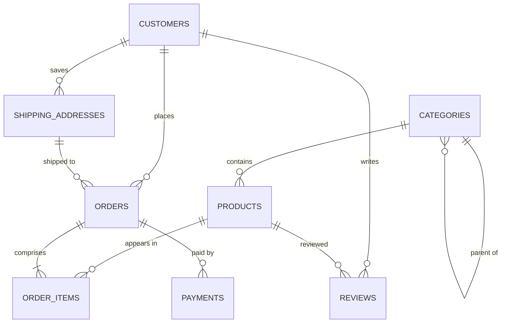

# 🛒 E-Commerce Database Schema

## Overview
This database schema models a production-ready e-commerce platform. It handles user registration, hierarchical product cataloging, shopping addresses, order management with automatic line total calculations, payment transaction records, and verified product reviews.

## Schema Architecture



## Table Descriptions

### 1. `customers`
Stores user profile information, contact details, and hashed passwords. Includes indexes on `email` and `phone` for fast lookup during login/auth.

### 2. `categories`
Handles product categories. It features a self-referencing foreign key (`parent_id`) allowing for multi-level category hierarchies (e.g., *Electronics → Computers → Laptops*).

### 3. `products`
The product catalog details prices, active discounts, stock levels, and associated categories. Uses check constraints to prevent negative pricing and a partial index for fast active-product filtering.

### 4. `shipping_addresses`
Stores delivery details. A customer can save multiple addresses, one of which can be flagged as `is_default`.

### 5. `orders`
Represents an e-commerce order, linking a customer and their chosen shipping address. It tracks order states (pending, confirmed, processing, etc.) using PostgreSQL enums.

### 6. `order_items`
Junction table mapping products to orders. Uses a generated column (`line_total`) to compute totals dynamically: `quantity * unit_price * (1 - discount_pct / 100)`. Enforces a unique constraint to prevent duplicate product entries within a single order.

### 7. `payments`
Tracks transactions. Features enums for payment statuses and payment methods, linking back to the order.

### 8. `reviews`
Tracks customer ratings (1 to 5) and textual reviews. Enforces a unique index `uq_review_customer_product` so a customer can write only one review per product.

---

## Sample Queries

### 1. Get Customer Order History with Statuses
Retrieves a customer's order totals, ordering date, and delivery statuses.
```sql
SELECT 
    o.order_id,
    o.ordered_at,
    o.status AS order_status,
    o.total_amount,
    p.status AS payment_status,
    p.method AS payment_method
FROM orders o
LEFT JOIN payments p ON o.order_id = p.order_id
WHERE o.customer_id = 101
ORDER BY o.ordered_at DESC;
```

### 2. Retrieve Hierarchical Products with Active Discounts
Finds active products under a category, showing their original prices and discounted prices.
```sql
SELECT 
    p.product_id,
    p.name AS product_name,
    c.name AS category_name,
    p.price AS original_price,
    p.discount_pct,
    ROUND(p.price * (1 - p.discount_pct / 100), 2) AS final_price,
    p.stock_quantity
FROM products p
JOIN categories c ON p.category_id = c.category_id
WHERE p.is_active = TRUE 
  AND (c.category_id = 1 OR c.parent_id = 1)
ORDER BY final_price ASC;
```

### 3. Calculate Monthly Revenue and Order Counts
Aggregates sales performance data month-by-month.
```sql
SELECT 
    TO_CHAR(ordered_at, 'YYYY-MM') AS sale_month,
    COUNT(order_id) AS total_orders,
    SUM(total_amount) AS gross_revenue,
    ROUND(AVG(total_amount), 2) AS average_order_value
FROM orders
WHERE status NOT IN ('cancelled', 'refunded')
GROUP BY TO_CHAR(ordered_at, 'YYYY-MM')
ORDER BY sale_month DESC;
```

### 4. Products with Highest Ratings and Verified Reviews
Finds average ratings and verified review counts per product.
```sql
SELECT 
    p.product_id,
    p.name AS product_name,
    ROUND(AVG(r.rating), 2) AS average_rating,
    COUNT(r.review_id) AS total_reviews,
    COUNT(CASE WHEN r.is_verified = TRUE THEN 1 END) AS verified_reviews
FROM products p
LEFT JOIN reviews r ON p.product_id = r.product_id
GROUP BY p.product_id, p.name
HAVING COUNT(r.review_id) > 0
ORDER BY average_rating DESC, total_reviews DESC;
```
