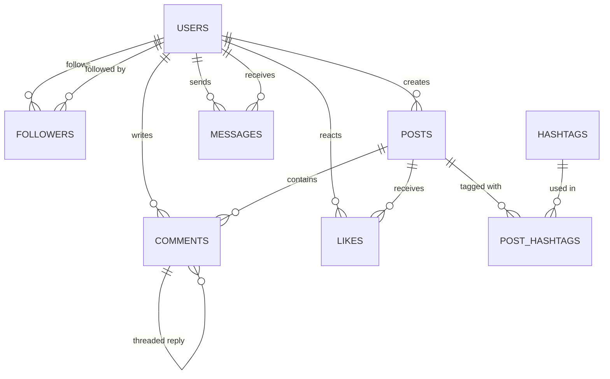

# 📱 Social Media Platform Database Schema

## Overview
This database schema models a complete backend infrastructure for a social networking platform. It handles user profiles, self-referencing relationship states (followers/following), posts with visibility scopes and media resources, threaded/hierarchical comments, user interactions (likes), direct messaging, and hashtag discovery.

## Schema Architecture



## Table Descriptions

### 1. `users`
Contains profile details, status enums, and verification flags. Includes indexes on `username` and `email` for quick authentication and user lookups.

### 2. `followers`
A self-referencing junction table implementing many-to-many user connections. Enforces a check constraint `chk_no_self_follow` to prevent users from following themselves.

### 3. `posts`
Represents user-generated posts. Features enums for post visibility (public, friends, private) and denormalized counters (`like_count`, `comment_count`) for low-latency feed generation. A partial index `idx_posts_active` skips soft-deleted posts.

### 4. `comments`
Stores threaded feedback. Features a self-referencing foreign key (`parent_id`) pointing to `comment_id` in the same table, allowing for unlimited nesting of replies.

### 5. `likes`
Junction table tracking user interactions. Enforces a composite primary key `(user_id, post_id)` to limit each user to a maximum of one like per post.

### 6. `messages`
Enables direct, private messages between users. Features a specialized expression index `idx_msg_conversation` using `LEAST/GREATEST` functions to optimize bi-directional chat lookups.

### 7. `hashtags`
A global registry of unique hashtags.

### 8. `post_hashtags`
Junction table mapping posts to hashtags for topic-based discovery.

---

## Sample Queries

### 1. Chronological Home Feed for a User
Retrieves public and friends-only posts from creators the specified user follows.
```sql
SELECT 
    p.post_id,
    p.content,
    p.media_url,
    p.created_at,
    u.username AS author_username,
    u.display_name AS author_display_name,
    p.like_count,
    p.comment_count
FROM posts p
JOIN users u ON p.user_id = u.user_id
JOIN followers f ON p.user_id = f.following_id
WHERE f.follower_id = 101 -- Current User
  AND p.is_deleted = FALSE
  AND p.visibility IN ('public', 'friends')
ORDER BY p.created_at DESC
LIMIT 20;
```

### 2. Retrieve Nested Comment Threads on a Post
Fetches replies organized in hierarchical order using parent-child links.
```sql
SELECT 
    c.comment_id,
    c.parent_id,
    c.content,
    c.created_at,
    u.username,
    c.like_count
FROM comments c
JOIN users u ON c.user_id = u.user_id
WHERE c.post_id = 42 
  AND c.is_deleted = FALSE
ORDER BY COALESCE(c.parent_id, c.comment_id), c.created_at ASC;
```

### 3. Get Private Chat History between Two Users
Retrieves direct messages exchanged between two users, sorted chronologically.
```sql
SELECT 
    message_id,
    sender_id,
    receiver_id,
    content,
    status,
    created_at
FROM messages
WHERE (sender_id = 101 AND receiver_id = 102)
   OR (sender_id = 102 AND receiver_id = 101)
   AND is_deleted = FALSE
ORDER BY created_at ASC;
```

### 4. Trending Hashtags Report
Retrieves the most popular hashtags based on post counts.
```sql
SELECT 
    h.tag AS hashtag,
    COUNT(ph.post_id) AS post_count
FROM hashtags h
JOIN post_hashtags ph ON h.hashtag_id = ph.hashtag_id
GROUP BY h.hashtag_id, h.tag
ORDER BY post_count DESC
LIMIT 10;
```
